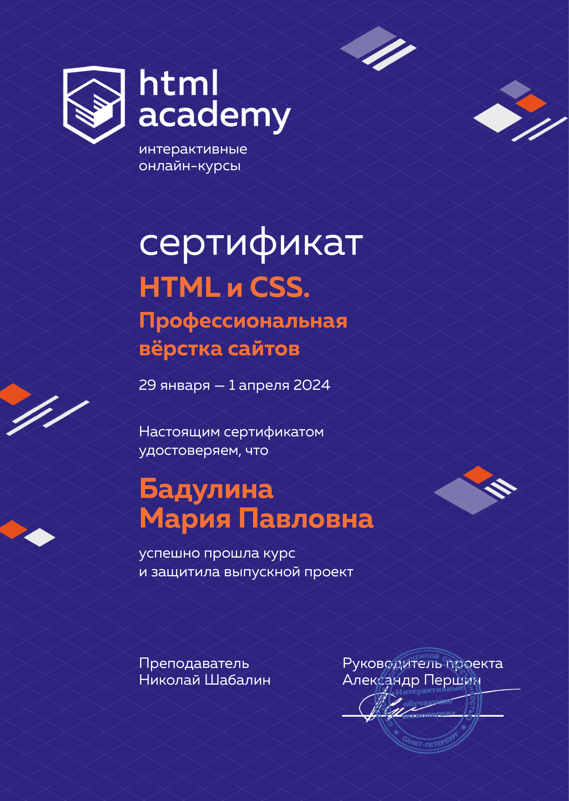

# Привет

## Меня зовут Мария
## Я Frontend разработчик

### Обучалась в [HTML Academy](https://htmlacademy.ru/) на Frontend разработчика. Проходила стажировку в [Лиге А](https://ligaa.agency/).

## Сертификаты

### Languages and Tools:

<!--
**MariBadulina/MariBadulina** is a ✨ _special_ ✨ repository because its `README.md` (this file) appears on your GitHub profile.

Here are some ideas to get you started:

- 🔭 I’m currently working on ...
- 🌱 I’m currently learning ...
- 👯 I’m looking to collaborate on ...
- 🤔 I’m looking for help with ...
- 💬 Ask me about ...
- 📫 How to reach me: ...
- 😄 Pronouns: ...
- ⚡ Fun fact: ...
-->
