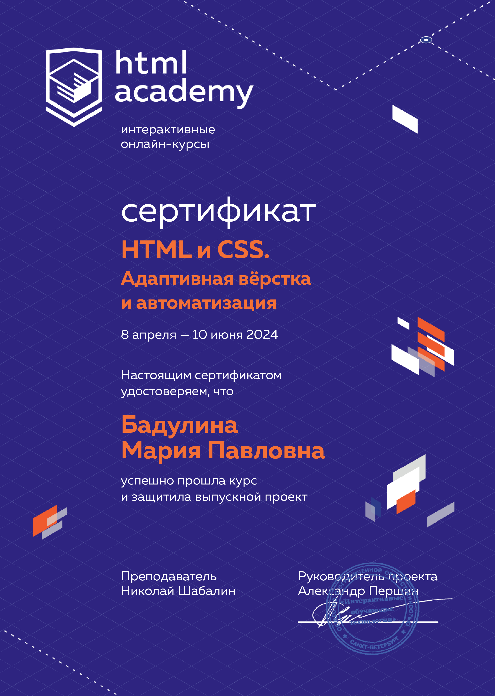
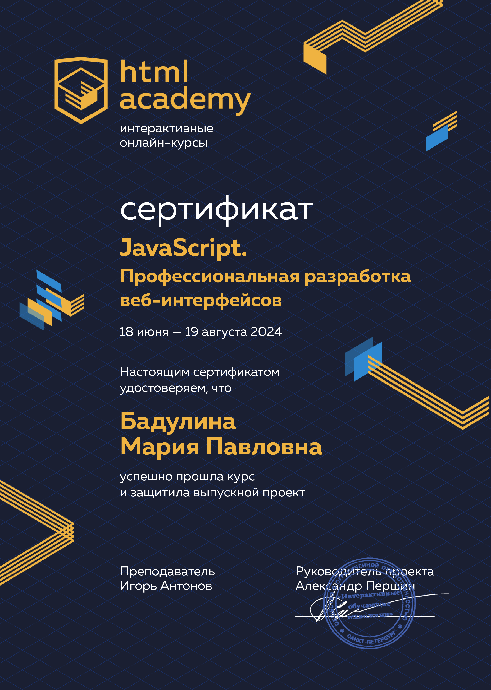
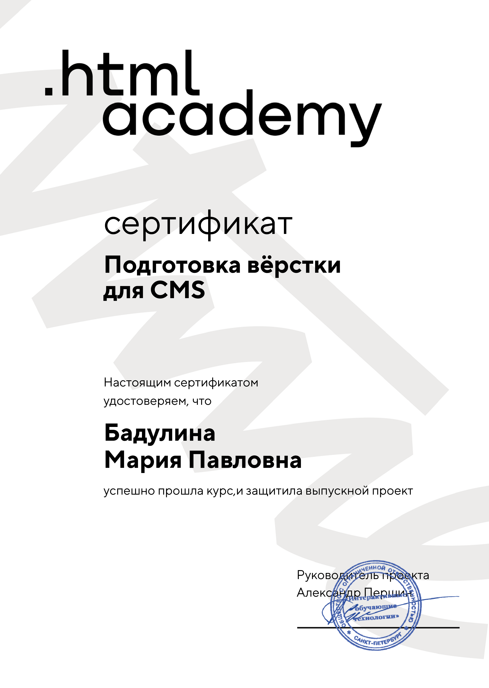
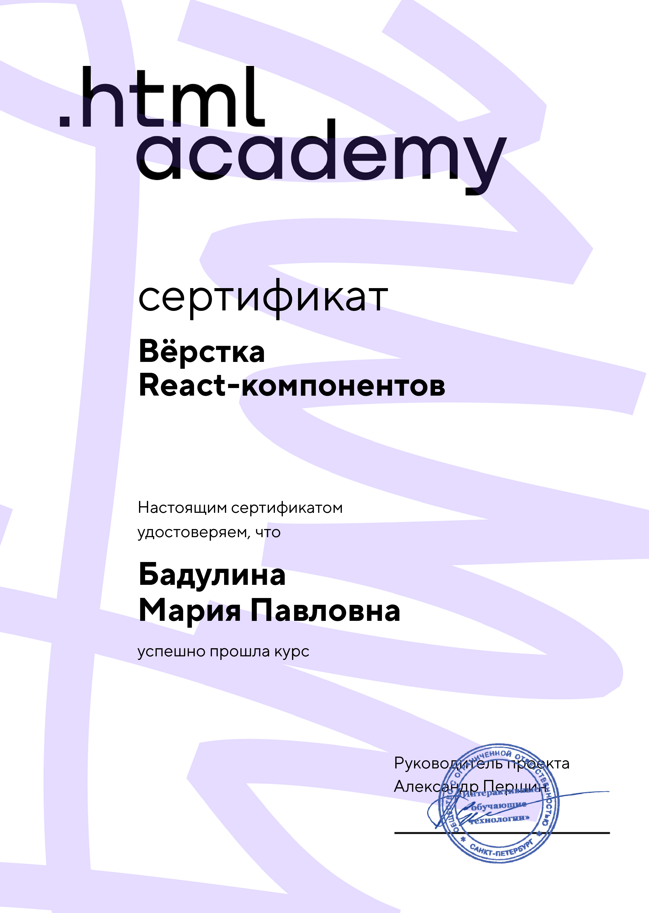
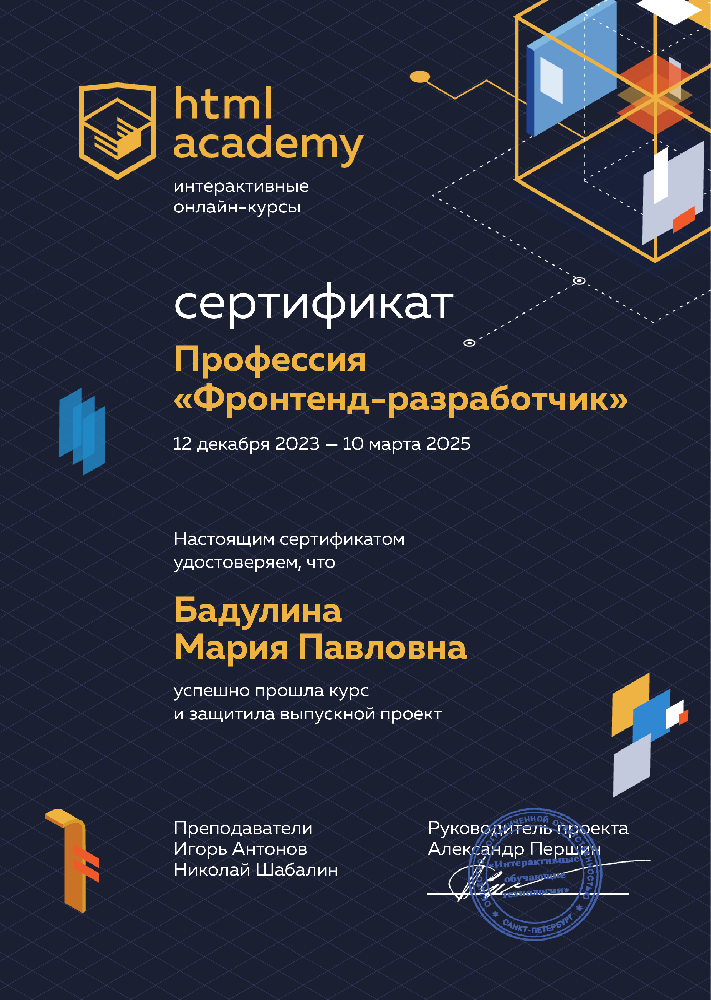

# Привет

## Меня зовут Мария
## Я Frontend разработчик

### Обучалась в [HTML Academy](https://htmlacademy.ru/) на Frontend разработчика. Проходила стажировку в [Лиге А](https://ligaa.agency/).

- адаптивная верстка
- работа с figma
- Pixel Perfect
- модульность в scss

## Сertificates

### Languages and Tools:

## В данный момент на HTML Academy обучаюсь на JavaScript разработчика. 

## React знаю только основы, в перспективах изучить его более тщательно

